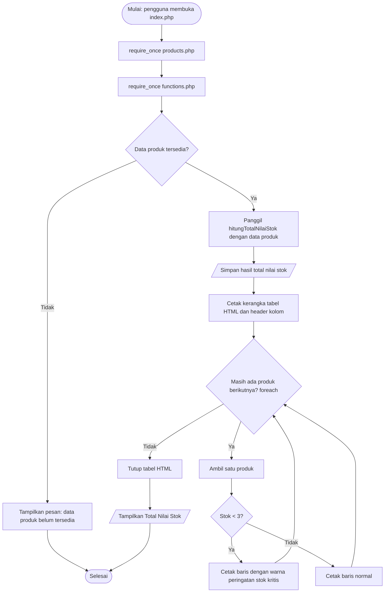
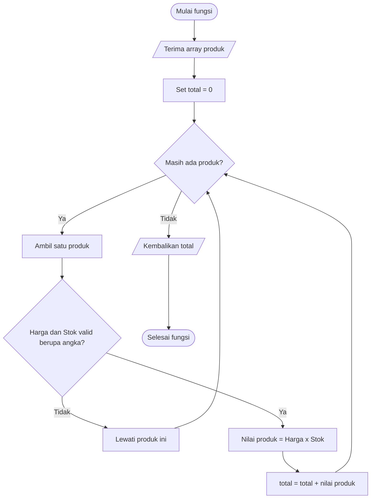
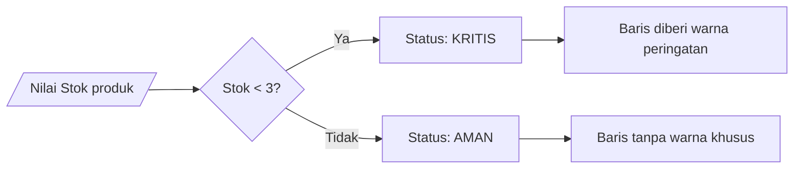
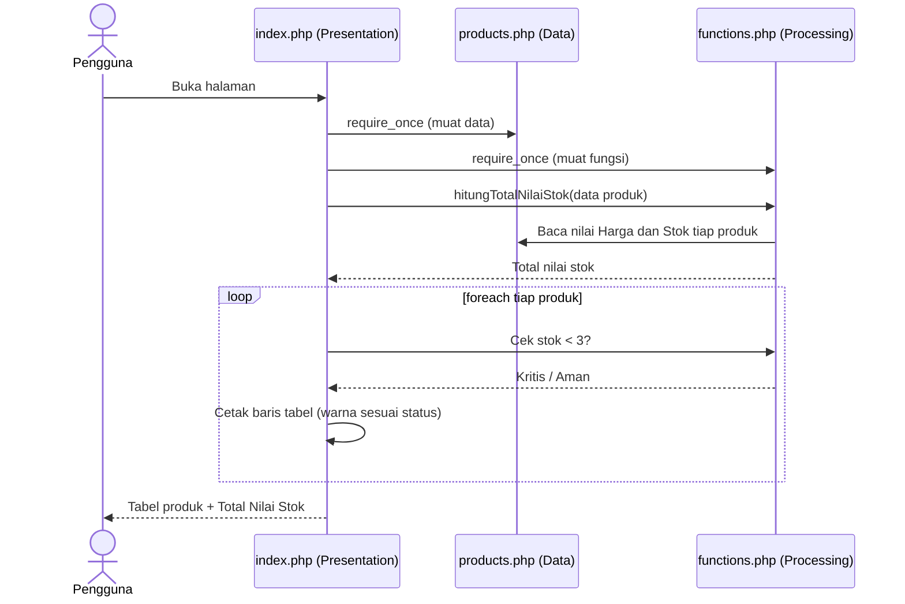

# Processing Flowchart
## Mini Project 1: Product Information System (Desain)

Dokumen ini menggambarkan alur logika sistem secara visual. Ini adalah **rancangan konseptual**, bukan kode program.

---

## 1. Flowchart Utama (Alur `index.php`)

---

## 2. Flowchart Fungsi `hitungTotalNilaiStok()`

---

## 3. Flowchart Logika Conditional (Stok Kritis)

---

## 4. Sequence Diagram Antar Layer

---

## 5. Tabel Uji Skenario (Trace Logika)

Contoh penelusuran manual memakai data konseptual:

| ID | Harga | Stok | Nilai (Harga x Stok) | Stok < 3? | Tampilan Baris |
|---|---|---|---|---|---|
| 1 | 8.000.000 | 10 | 80.000.000 | Tidak | Normal |
| 2 | 150.000 | 2 | 300.000 | Ya | Peringatan |
| 3 | 300.000 | 5 | 1.500.000 | Tidak | Normal |
| 4 | 2.000.000 | 1 | 2.000.000 | Ya | Peringatan |
| | | | **Total: 83.800.000** | | |

### Kasus Batas
| Skenario | Hasil yang Diharapkan |
|---|---|
| Stok = 3 | Normal (batas kritis adalah kurang dari 3) |
| Stok = 0 | Peringatan; nilai stok 0 |
| Array produk kosong | Pesan data belum tersedia; total 0 |
| Harga/Stok bukan angka | Produk dilewati dari perhitungan |

---

## 6. Keterangan Simbol

| Simbol | Arti |
|---|---|
| Oval `([ ])` | Awal / akhir proses |
| Persegi `[ ]` | Langkah proses |
| Belah ketupat `{ }` | Keputusan / percabangan |
| Jajar genjang `[/ /]` | Input / output |
