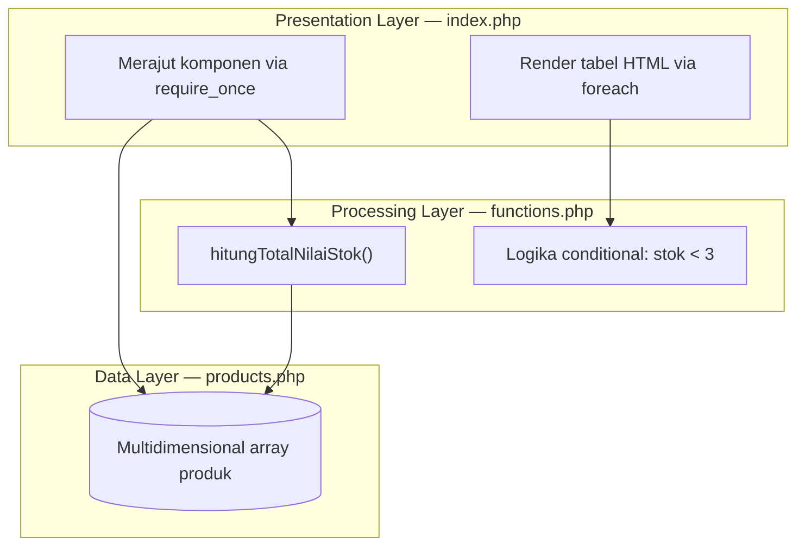

# SAD — Software Architecture Document
## Mini Project 1: Product Information System (Desain)

| Atribut | Keterangan |
|---|---|
| Jenis Sesi | Perancangan blueprint (Sesi Tanpa Coding / Pengetikan Kode) |
| Bahasa Target | PHP (native, tanpa framework, tanpa database) |
| Versi Dokumen | 1.0 |
| Status | Draft desain konseptual |

---

## 1. Pendahuluan

### 1.1 Tujuan
Merancang struktur blueprint sistem manajemen data informasi produk siap pakai berbasis konsep teori yang telah dipelajari.

### 1.2 Ruang Lingkup
Sistem menampilkan daftar produk dalam bentuk tabel HTML, menghitung total nilai aset stok gudang, dan menandai visual baris produk yang stoknya kritis.

**Di dalam ruang lingkup:**
- Penyimpanan data produk dalam multidimensional array
- Perhitungan total nilai stok
- Penyaringan warna baris tabel berdasarkan kondisi stok
- Penyajian data ke tabel HTML

**Di luar ruang lingkup (sesi ini):**
- Penulisan kode program
- Database, autentikasi, dan fitur CRUD (tambah/ubah/hapus)

### 1.3 Batasan Sesi
Sesuai catatan penting: pembelajaran hanya berfokus pada pematangan cetak biru konsep arsitektur desain secara logis. Seluruh dokumen ini hanya berisi rancangan, **tidak ada implementasi kode**.

### 1.4 Istilah
| Istilah | Arti |
|---|---|
| Stok kritis | Produk dengan jumlah stok **< 3** |
| Nilai stok | Harga × Stok per produk |
| Total nilai stok | Jumlah seluruh nilai stok semua produk |

---

## 2. Gambaran Arsitektur

Sistem memakai **arsitektur tiga lapis (3-Layer)** dengan pemisahan tanggung jawab yang jelas.



### 2.1 Prinsip Desain
1. **Separation of Concerns** — data, logika, dan tampilan dipisah pada berkas berbeda.
2. **Single Responsibility** — tiap berkas punya satu tugas utama.
3. **Reusability** — logika di functions.php dapat dipakai ulang tanpa mengubah data atau tampilan.
4. **Kesederhanaan** — tanpa dependensi eksternal.

---

## 3. Rincian Komponen

### 3.1 Data Layer — `products.php`
**Peran:** penampung multidimensional array yang menyimpan data komoditas produk.

**Struktur data (satu elemen = satu produk):**

| Field | Tipe Data | Keterangan |
|---|---|---|
| ID | Integer / String | Identitas unik produk |
| Nama | String | Nama produk |
| Kategori | String | Pengelompokan produk |
| Harga | Integer / Float | Harga satuan |
| Stok | Integer | Jumlah barang di gudang |
| Deskripsi | String | Keterangan singkat produk |

**Aturan desain:**
- Berkas hanya menyimpan data, tanpa logika dan tanpa output HTML.
- Setiap produk memiliki seluruh enam field dengan urutan konsisten.
- ID tidak boleh duplikat.

**Contoh data konseptual (bukan kode):**

| ID | Nama | Kategori | Harga | Stok | Deskripsi |
|---|---|---|---|---|---|
| 1 | Laptop | Elektronik | 8.000.000 | 10 | Laptop kerja 14 inci |
| 2 | Mouse | Aksesori | 150.000 | 2 | Mouse nirkabel |
| 3 | Keyboard | Aksesori | 300.000 | 5 | Keyboard mekanik |
| 4 | Monitor | Elektronik | 2.000.000 | 1 | Monitor 24 inci |

### 3.2 Processing Layer — `functions.php`
**Peran:** pusat logika bisnis sistem.

**Fungsi 1 — `hitungTotalNilaiStok()`**

| Aspek | Rancangan |
|---|---|
| Tujuan | Mengalkulasi total nilai aset gudang |
| Input | Array produk dari Data Layer |
| Proses | Untuk tiap produk, kalikan Harga dengan Stok, lalu jumlahkan semua hasil |
| Output | Satu angka: total nilai stok |
| Kasus khusus | Array kosong menghasilkan 0 |

**Logika conditional — penyaringan warna baris**

| Kondisi | Hasil |
|---|---|
| Stok **< 3** | Baris ditandai warna peringatan (stok kritis) |
| Stok **≥ 3** | Baris tampil normal |

Catatan: batas 3 didefinisikan sebagai ketentuan tunggal agar mudah diubah.

### 3.3 Presentation Layer — `index.php`
**Peran:** merajut seluruh komponen dan merender data ke layout tabel HTML.

**Tanggung jawab:**
1. Memuat `products.php` dan `functions.php` menggunakan `require_once` (mencegah pemuatan ganda).
2. Memanggil `hitungTotalNilaiStok()` untuk mendapat total nilai aset.
3. Melakukan perulangan `foreach` atas data produk untuk membentuk baris tabel.
4. Menerapkan hasil logika conditional untuk warna baris.
5. Menampilkan total nilai stok pada bagian ringkasan.

**Rancangan layout:**

```
+------------------------------------------------------+
|  Judul Halaman: Product Information System           |
+------+--------+----------+-------+------+-----------+
|  ID  |  Nama  | Kategori | Harga | Stok | Deskripsi |
+------+--------+----------+-------+------+-----------+
|  ... baris produk (foreach)                          |
|  ... baris stok < 3 berwarna peringatan              |
+------------------------------------------------------+
|  Total Nilai Stok: Rp xxx                            |
+------------------------------------------------------+
```

---

## 4. Ketergantungan Antar Komponen

| Berkas | Bergantung pada | Alasan |
|---|---|---|
| `products.php` | — | Sumber data mandiri |
| `functions.php` | Struktur data dari `products.php` (lewat parameter) | Mengolah data yang diberikan |
| `index.php` | `products.php`, `functions.php` | Perajut dan penampil |

Arah ketergantungan satu arah: **Presentation → Processing → Data**. Lapisan bawah tidak mengenal lapisan di atasnya.

---

## 5. Aliran Data (Ringkas)

1. `index.php` dijalankan.
2. `index.php` memuat `products.php` dan `functions.php`.
3. Data produk diteruskan ke `hitungTotalNilaiStok()`.
4. Total nilai stok dikembalikan ke `index.php`.
5. `foreach` menelusuri produk; tiap baris dicek kondisi stok < 3.
6. Tabel HTML dan total nilai stok ditampilkan.

Diagram rinci ada di `Processing_flowchart.md`.

---

## 6. Kebutuhan Non-Fungsional

| Aspek | Target |
|---|---|
| Keterbacaan | Struktur berkas dan penamaan jelas |
| Keterpeliharaan | Perubahan data, logika, atau tampilan tidak saling mengganggu |
| Kemudahan diperluas | Fungsi atau field baru dapat ditambah tanpa merombak arsitektur |
| Keamanan dasar | Data yang ditampilkan perlu di-escape agar aman dari injeksi HTML |
| Portabilitas | Berjalan di server PHP standar tanpa dependensi |

---

## 7. Risiko dan Mitigasi

| Risiko | Dampak | Mitigasi |
|---|---|---|
| Field produk tidak lengkap | Tabel/perhitungan salah | Tetapkan skema baku 6 field |
| Harga atau stok bukan angka | Hasil hitung keliru | Validasi tipe data sebelum kalkulasi |
| Array kosong | Tabel kosong tanpa penjelasan | Tampilkan pesan "data belum tersedia" |
| Berkas gagal dimuat | Halaman berhenti | `require_once` sengaja memakai perilaku fatal agar kesalahan segera terlihat |

---

## 8. Rencana Pengembangan Lanjutan (Opsional)
- Format mata uang rupiah
- Pencarian dan filter kategori
- Pengurutan kolom
- Migrasi Data Layer ke database

---

## 9. Kriteria Keberhasilan Desain
- [ ] Tiga layer terdefinisi jelas beserta tanggung jawabnya
- [ ] Skema data produk lengkap (ID, Nama, Kategori, Harga, Stok, Deskripsi)
- [ ] Logika `hitungTotalNilaiStok()` terdokumentasi
- [ ] Aturan stok kritis (< 3) terdokumentasi
- [ ] Alur render di `index.php` (`require_once` dan `foreach`) terdokumentasi
- [ ] Tidak ada kode program pada dokumen (sesuai batasan sesi)
